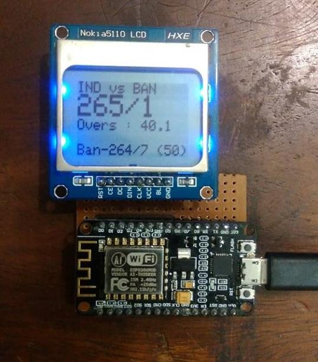

# Live_ScoreBoard_Esp
To display live cricket scores on nokia 5110 using nodemcu.

## Description:

### Hardware :

* nodemcu
* Nokia 5110 GLCD

### Libraries :

* [Adafruit GFX Graphics](https://github.com/adafruit/Adafruit-GFX-Library)
* [Adafruit PCD8544 Nokia 5110 LCD](https://github.com/adafruit/Adafruit-PCD8544-Nokia-5110-LCD-library)

### Api :

[Cric Api](http://www.cricapi.com)

